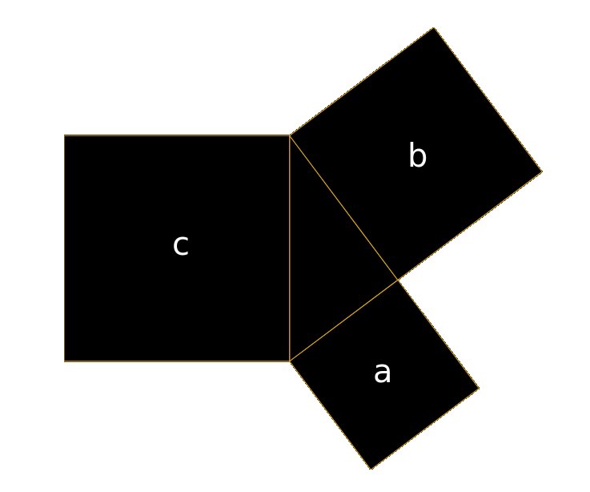
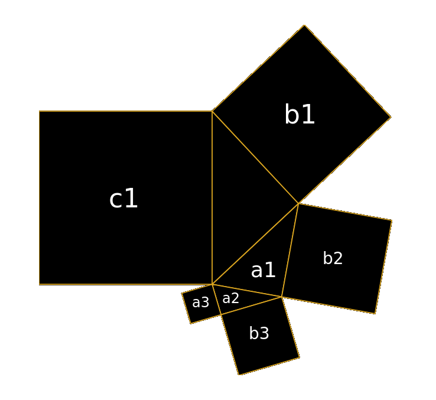

# P33

A simple library for generating coordinates of Pythagorean Triangles that are intended for visualisation.

**Made to be plundered**

## Functions

This library only provides two functions, `generateGeometry` and `geometryToSvg`.

```js
import { generateGeometry, geometryToSvg } from 'p33'
```

### `generateGeometry`

`generateGeometry` converts an object schema of a right angle triangle into a geometry object containing coordinates and metadata for plotting the triangle. The geometry is intended for plotting and thus mathematical precision was traded off for simplicity and ease of implementation in JavaScript.

Right triangles can be nested such that the opposite and adjacent sides can be Hypotenuse for another right angle triangle. This gives it a somewhat fractal nature but in reality you can only go two or three deep before the polygons of the inner start to overlap the outer.

#### Arguments

1. **schema**: An `object` specifying the opposite and adjacent lengths of the right angle triangle.

```js
generateGeometry({
	a: 3,
	b: 4,
})
```

Above is a simple schema for the right triangle (3, 4, 5). This is also a Pythagorean Triple. `a` and `b` can be any positive number you would like but I'd suggest not going mad with high numbers since the implementation just uses JavaScript's crude `number` type for claculations.

```js
generateGeometry({
	a: {
		a: 3,
		b: 4,
	},
	b: 12,
})
```

Above is a schema with a nested right triangle. To be precise, it represents the right trangle (3, 4, 5) nested into the right triangle (5, 12, 13). The Hypotenuse 5 in the first set is a minor side in the second.

#### Returns

A geometry `object` containing details for plotting the right triangle on a diagram. The coordinate system has its origin in the bottom left so plotting straight into an SVG or HTML Canvas would render a vertically mirrored image (web language coordinate systems typically have their origin in the top left).

```js
const geometry = {
	a: 3,
	b: 4,
	c: 5, // Hypotenuse
	width: 10.6,
	height: 9.8,
	polygons: [
		{
			shape: 'triangle',
			points: [
				{ x: 5, y: 2.4, angle: 0.6435011087932844 },
				{ x: 7.4, y: 5.6, angle: RIGHT_ANGLE },
				{ x: 5, y: 7.4, angle: RIGHT_ANGLE - 0.6435011087932844 },
			],
		},
		{
			side: 'c',
			shape: 'square',
			points: [
				{ x: 0, y: 2.4, angle: RIGHT_ANGLE },
				{ x: 5, y: 2.4, angle: RIGHT_ANGLE },
				{ x: 5, y: 7.4, angle: RIGHT_ANGLE },
				{ x: 0, y: 7.4, angle: RIGHT_ANGLE },
			],
		},
		{
			side: 'b',
			shape: 'square',
			points: [
				{ x: 8.2, y: 0, angle: RIGHT_ANGLE },
				{ x: 10.6, y: 3.2, angle: RIGHT_ANGLE },
				{ x: 7.4, y: 5.6, angle: RIGHT_ANGLE },
				{ x: 5, y: 2.4, angle: RIGHT_ANGLE },
			],
		},
		{
			side: 'a',
			shape: 'square',
			points: [
				{ x: 5, y: 7.4, angle: RIGHT_ANGLE },
				{ x: 7.4, y: 5.6, angle: RIGHT_ANGLE },
				{ x: 9.2, y: 8, angle: RIGHT_ANGLE },
				{ x: 6.8, y: 9.8, angle: RIGHT_ANGLE },
			],
		},
	],
}
```

Above is the output of the simple right triangle (3, 4, 5).



```js
{
	a: {
		a: 3,
		b: 4,
		c: 5,
	},
	b: 12,
	c: 13,
	...,
	polygons: [
		...,
		{
			a: 3,
			b: 4,
			c: 5,
			polygons: [
				{
					shape: 'triangle',
					points: [
						{ x: 17.6153846, y: 15.6923077, angle: 0.6435011087932844 },
						{ x: 15.5846154, y: 19.1384615, angle: RIGHT_ANGLE },
						{
							x: 13,
							y: 17.6153846,
							angle: RIGHT_ANGLE - 0.6435011087932844,
						},
					],
				},
				{
					side: 'b',
					shape: 'square',
					points: [
						{ x: 21.0615385, y: 17.7230769, angle: RIGHT_ANGLE },
						{ x: 19.0307692, y: 21.1692308, angle: RIGHT_ANGLE },
						{ x: 15.5846154, y: 19.1384615, angle: RIGHT_ANGLE },
						{ x: 17.6153846, y: 15.6923077, angle: RIGHT_ANGLE },
					],
				},
				{
					side: 'a',
					shape: 'square',
					points: [
						{ x: 13, y: 17.6153846, angle: RIGHT_ANGLE },
						{ x: 15.5846154, y: 19.1384615, angle: RIGHT_ANGLE },
						{ x: 14.0615385, y: 21.7230769, angle: RIGHT_ANGLE },
						{ x: 11.4769231, y: 20.2, angle: RIGHT_ANGLE },
					],
				},
			],
		},
	],
}
```

Above is an example of a nested geometry with numbers limited to seven decimal places. This was applied after generation as `generateGeometry` performs no explicit rounding.

Notice that `side: 'c'` has been omitted since it should not be rendered. There is no limit to the amount of nesting but anymore than three levels causes visual overlap.



### `geometryToSvg`

`geometryToSvg` converts geometry generated via `generateGeometry` and creates a hierarchy of SVG HTML elements. Render the elements in a web page to visualise.

Only basic styling is applied so you'll need to descend the element tree, setting your own styles, if you want something pretty.

#### Arguments

1. **geometry**: A geometry `object` produced by the `generateGeometry` function.

#### Returns

A `HTMLElement` representing an `<svg>`. Appending this to an appropriate DOM element will render it on a web page.
